# LLVM Pass example
LLVM IR traces. Top most executed instructions during program runtime

## Usage:
```
clang++ Pass_cfg.cpp -c -fPIC -I`llvm-config --includedir` -o Pass.o
clang++ Pass.o -fPIC -shared -o libPass.so
clang ../SDL/app.c -c -o app.o -Xclang -load -Xclang ./libPass.so -O2
clang ../SDL/lib/sim.c log.c app.o -o IR_traces -lSDL2
```

#### For most recent versions of clang you might need to add `-flegacy-pass-manager`:
```
clang ../SDL/app.c -c -o app.o -Xclang -load -Xclang ./libPass.so -O2 -flegacy-pass-manager
```

#### If the compiler does not see `begin_code.h` file (as it was for me), you can try:
```
clang ../SDL/lib/sim.c log.c app.o -o IR_traces -lSDL2 -I/usr/include/SDL2
```


#### Staitistics


##### O1:
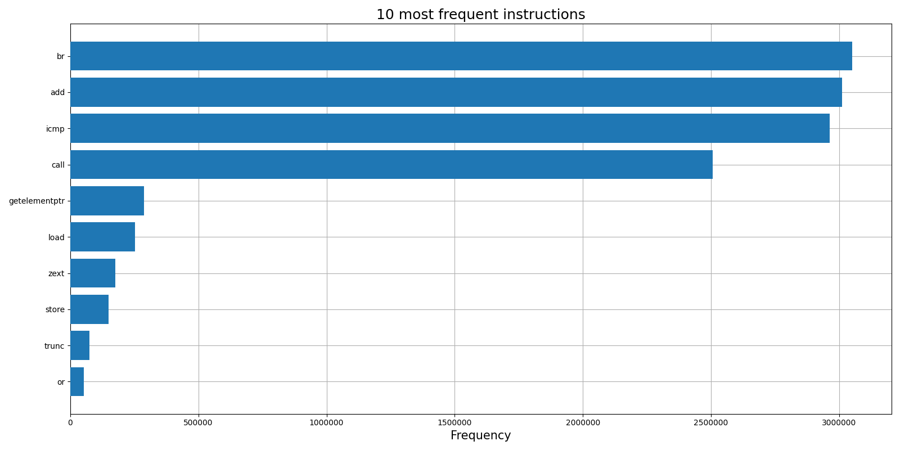
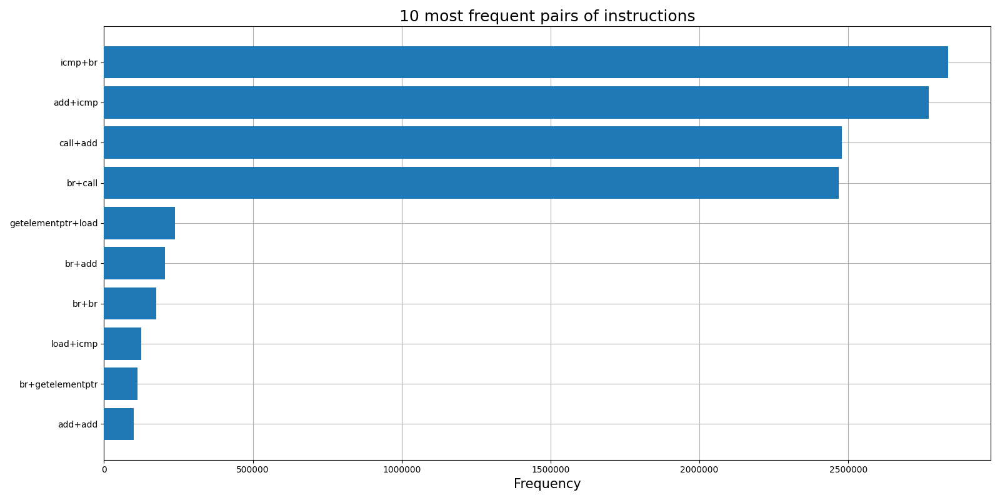
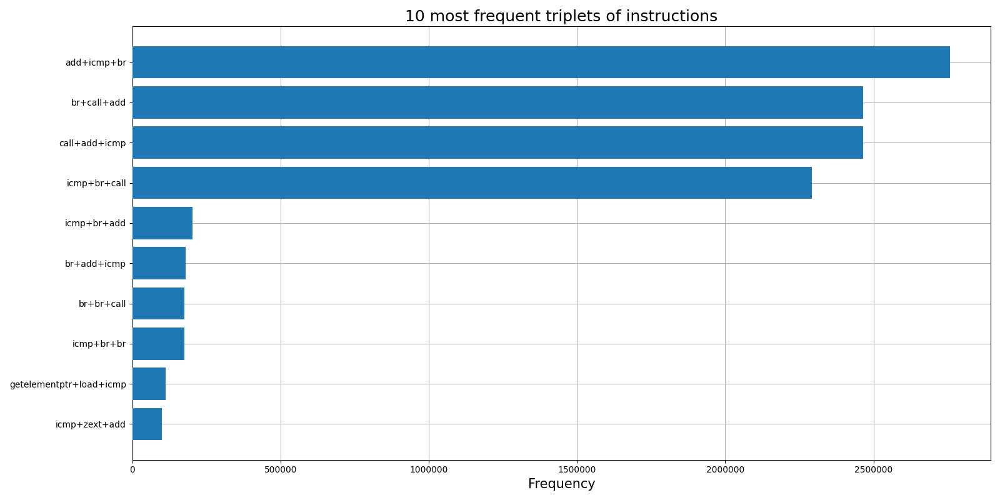
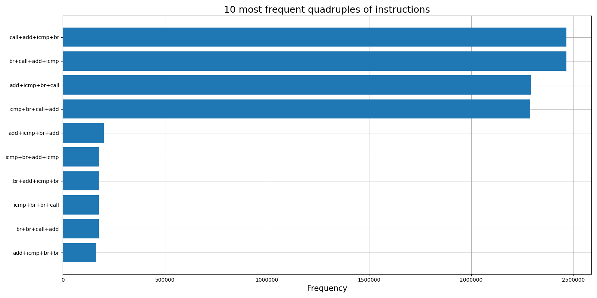
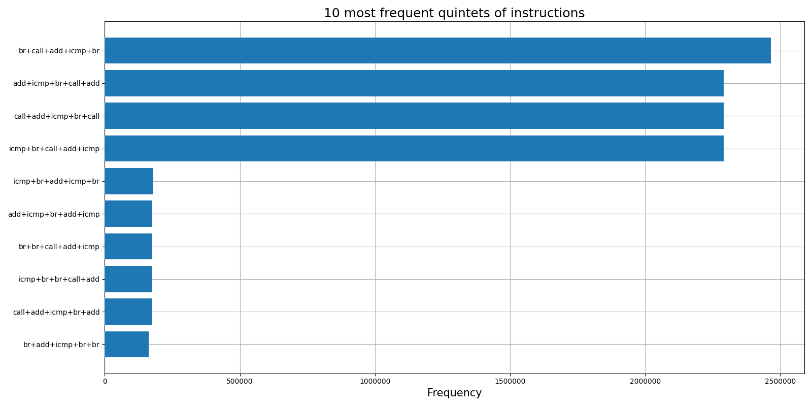


##### O2:
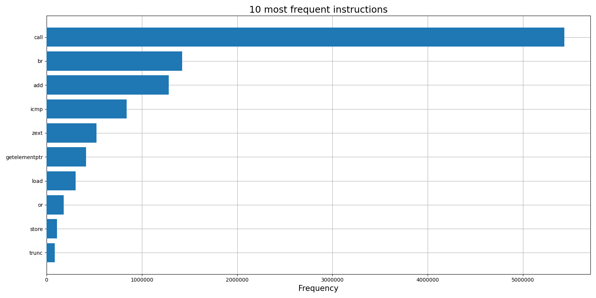
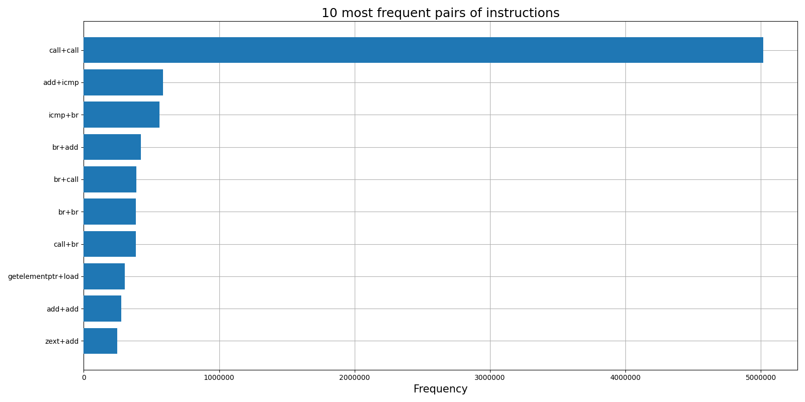
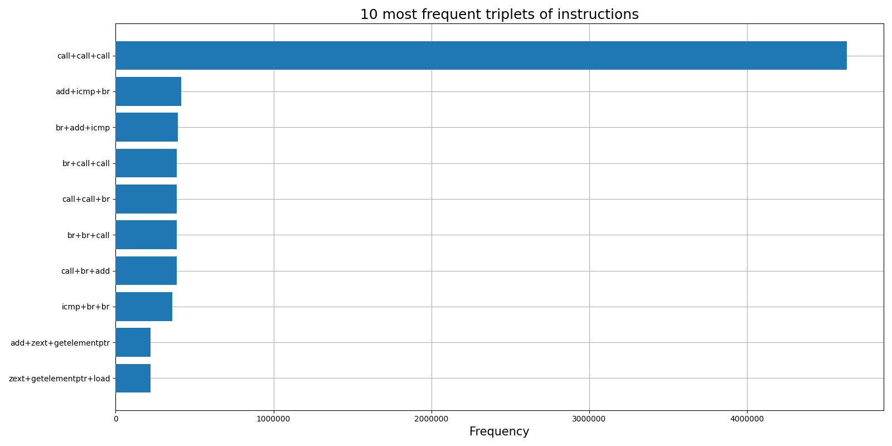
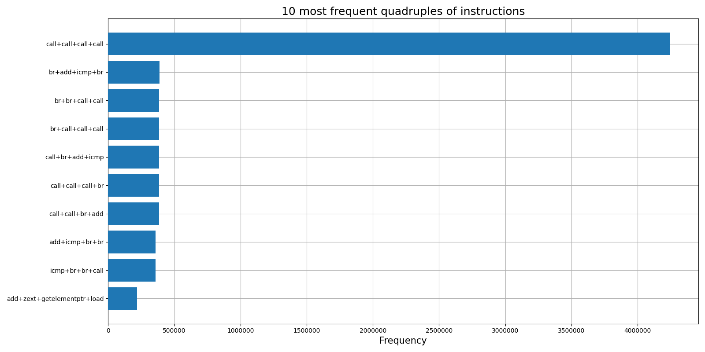
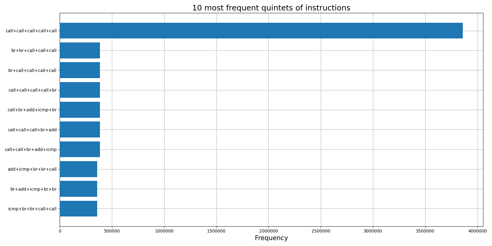


##### O3:
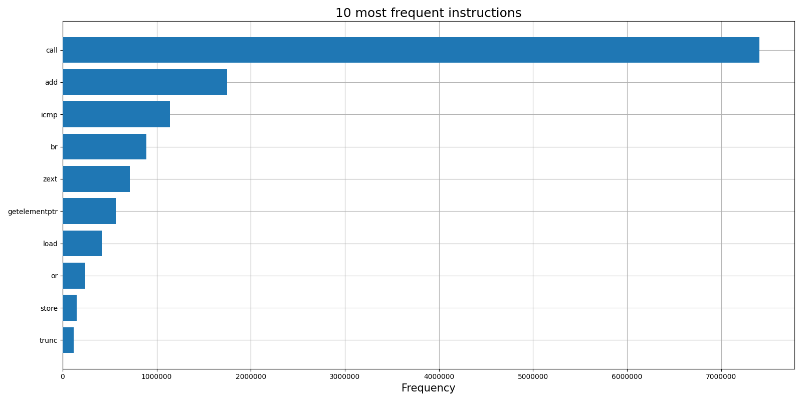
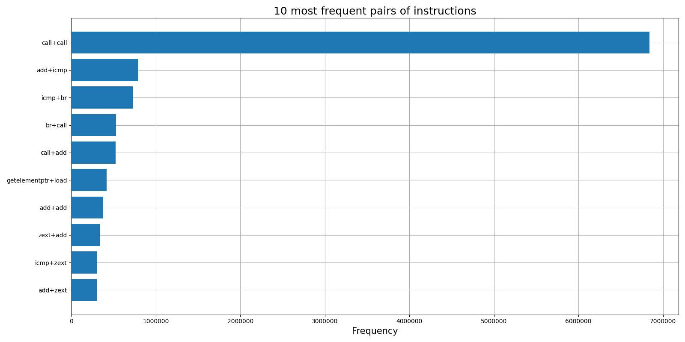
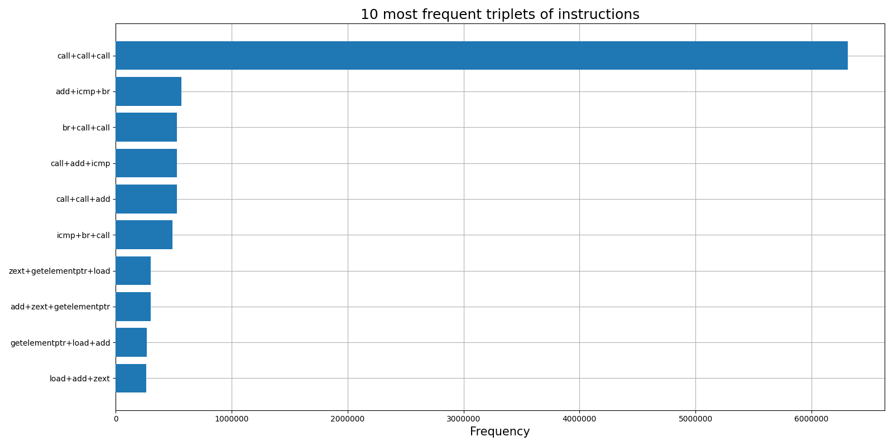
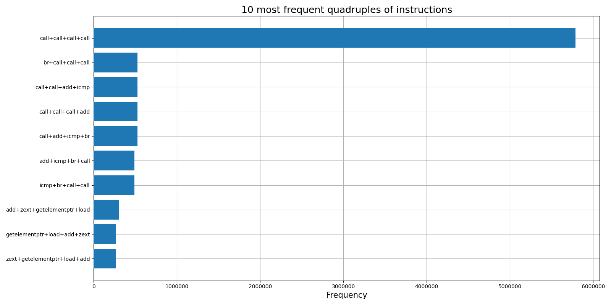
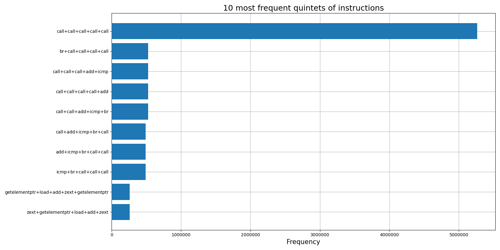
